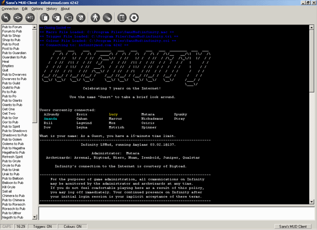

<div align="center">

## Sanx's MUD Client


</div>

### Description

Connects to MUDs, MUSHs, MUCKs, MOOs and any other talkers. Supports ANSI colour, triggers, colour highlighting, macros and includes various display options and a note-writer too.

It represents about 9 months work, all in all, and any and all comments are greatly appreciated.
 
### More Info
 
Almost no commenting, but the code is self-explanatory for the most part.


<span>             |<span>
---                |---
**Submitted On**   |2001-08-21 16:27:48
**By**             |[Sanx](https://github.com/Planet-Source-Code/PSCIndex/blob/master/ByAuthor/sanx.md)
**Level**          |Intermediate
**User Rating**    |5.0 (15 globes from 3 users)
**Compatibility**  |VB 6\.0
**Category**       |[Games](https://github.com/Planet-Source-Code/PSCIndex/blob/master/ByCategory/games__1-38.md)
**World**          |[Visual Basic](https://github.com/Planet-Source-Code/PSCIndex/blob/master/ByWorld/visual-basic.md)
**Archive File**   |[Sanx's MUD250418212001\.zip](https://github.com/Planet-Source-Code/sanx-sanx-s-mud-client__1-26441/archive/master.zip)

### API Declarations

```
Attribute VB_Name = "PublicFuncs"
Declare Function SetWindowPos Lib "user32" _
     (ByVal hwnd As Long, ByVal hWndInsertAfter As Long, _
     ByVal X As Long, ByVal Y As Long, ByVal cx As Long, _
     ByVal cy As Long, ByVal wFlags As Long) As Long
Private Declare Function FlashWindow Lib "user32" (ByVal hwnd As Long, ByVal bInvert As Long) As Long
Public Declare Function GetTickCount Lib "kernel32.dll" () As Long
```


